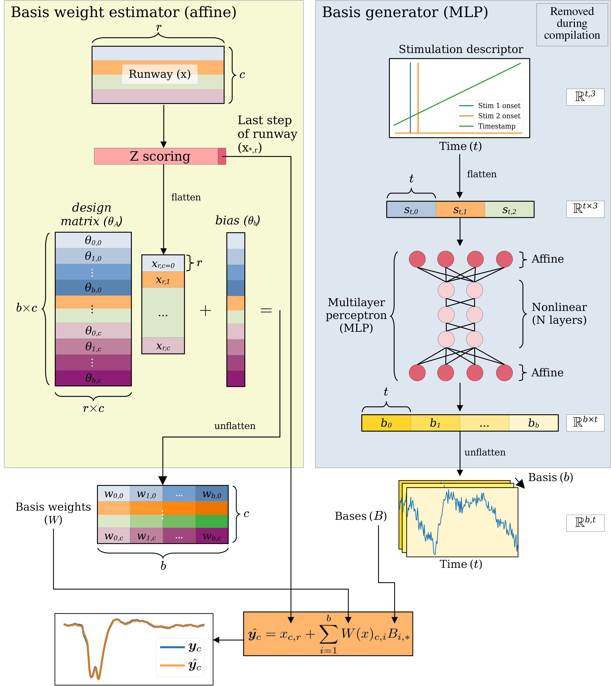
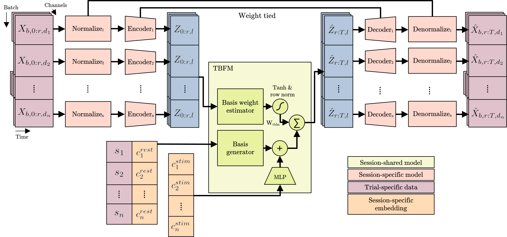

# py-tbfm
Implementation of the Temporal Basis Function Model (TBFM)

## Quick start
If you are looking to use the TBFM implementation, simply install this module; e.g.:

```
pip install .
```

then use it as follows:

```
model = tbfm.TBFM(NUM_CHANNELS,              # Dimensionality of time series
                  STIM_DESC_DIM,             # Dimensionality of stimulation descriptor
                  RUNWAY_LENGTH,             # Length of runway, in time steps
                  NUM_BASES,                 # Number of bases we will learn
                  FORECAST_HORIZON,          # Length of forecast, in time steps
                  batchy=y_train,            # A training dataset, for estimating means/stdevs
                  latent_dim=LATENT_DIM,     # Latent dimension of basis generator network
                  basis_depth=BASIS_DEPTH,   # Depth of basis generator network
                  device=DEVICE)             # Choice of device, e.g. "cpu" or "cuda:0"
optim = model.get_optim(lr=2e-4)             # Optimizer for use in training
```

A forward pass looks like this:
```
FORECAST_HORIZON = TRIAL_LENGTH - RUNWAY_LENGTH

yhat = model(
             runways,            # tensor shaped (batch_size, RUNWAY_LENGTH, NUM_CHANNELS)
             stim_descriptor,    # tensor shaped (batch_size, FORECAST_HORIZON, STIM_DESC_DIM)
       )

# yhat is a tensor shaped (batch_size, FORECAST_HORIZON, NUM_CHANNELS)
```

## Walkthrough and demo

For multi-session and meta-learning functionality, check out the [`multisession`](https://github.com/mmattb/py-tbfm/tree/multisession) branch of this repository and get started with the [`scripts/tma_standalone.py`](https://github.com/mmattb/py-tbfm/blob/multisession/scripts/tma_standalone.py) training script. It trains a shared TBFM across many sessions using MAML-style inner-loop adaptation, with per-session learnable stimulus embeddings.

**Required environment variable:**
```bash
export TBFM_DATA_DIR=/path/to/your/data
```

The data directory should contain one subdirectory per session (e.g. `MonkeyG_20150914_Session1_S1/`), each with a `torchraw/` subdirectory containing pre-processed trial tensors.

**Basic usage:**
```bash
python scripts/tma_standalone.py NUM_BASES NUM_SESSIONS GPU_ID COADAPT BASIS_RESIDUAL_RANK TRAIN_SIZE SHUFFLE
```

Key arguments:
- `NUM_BASES` — number of temporal bases (e.g. `100`)
- `NUM_SESSIONS` — number of sessions to include in training
- `GPU_ID` — GPU index, or `-1` for CPU
- `COADAPT` — `true` to use co-adaptation (trains per-session embeddings via outer loop); `false` for MAML inner-loop adaptation
- `BASIS_RESIDUAL_RANK` — rank of the per-session basis residual (LoRA-style correction); `0` disables residual mode and uses concatenation instead
- `TRAIN_SIZE` — number of training trials per session
- `SHUFFLE` — `true` to randomly sample support sets each epoch (recommended)

See [`python scripts/tma_standalone.py --help`](https://github.com/mmattb/py-tbfm/blob/multisession/scripts/tma_standalone.py) for the full list of options, including ablation flags.

## Demos and walkthroughs

- **`TBFM Demo.ipynb`** — single-session walkthrough using synthetic data
- **`TBFM FSAM Demo.ipynb`** — builds the TBFM via forward stagewise additive modeling; recommended after the first demo
- **`TBFM Traveling Wave Demo.ipynb`** — demonstrates TBFM applied to traveling wave data
- **`TBFM Multisession Demo.ipynb`** — full multi-session workflow: pretraining across synthetic sessions and test-time adaptation to held-out sessions

## Architecture



## Multisession Architecture

